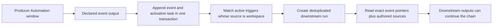

# Automations: activation, data, outputs, and chaining

This is the source map for Lobu's Automation primitives. It describes what the
product supports now, how the pieces compose, and where a dedicated workflow
engine would still add something real.

## The core model

An Automation is a versioned task owned by an agent. Its fields have separate
jobs:

| Primitive | What it decides | What it does not decide |
|---|---|---|
| Trigger | When a run starts | What durable context the run may read |
| Prompt and skills | What the agent should do | When it starts |
| Sources | What additional governed data a window reads | Whether new data activates it |
| Outputs | Which entity rows or append-only events a completed window persists | External side effects |
| Reaction or connector action | Which governed side effect follows analysis | The durable output contract |
| Run | Claiming, retries, busy policy, cooldown, audit, and status | Business meaning |
| ACL and approval policy | What the principal may read or change | Scheduling |

SQL sources are reads. An Automation does not gain an ungoverned database-write
escape hatch by declaring SQL. Persisted changes go through declared outputs,
the ClientSDK, reactions, connector actions, and their existing ACL or approval
rails.

## Activation types

The `triggers` array is an OR: any matching trigger may start the Automation. If
more than one trigger matches the same delivery, the first matching trigger's
execution and busy policy wins.

| Trigger | Use it for | Default execution | Busy default |
|---|---|---|---|
| No trigger | Explicit manual/API/SDK runs | Window | Existing run policy |
| `schedule` | Time-based analysis | Window | Coalesce |
| `event`, `source: "connector"` | Authenticated connector deliveries such as a Slack message or GitHub PR | Turn | Queue |
| `event`, `source: "workspace"` | A declared durable event output from another Automation | Window | Coalesce |

`event` is one public trigger primitive; `source` records its provenance.
Existing connector triggers that omit `source` remain readable and normalize to
`source: "connector"` on write. A connector's declared `automationEvents` are the
allowed catalog for connector-sourced events; when a connector declares none,
the platform derives the catalog from its feed `eventKinds` (default-on). Each
declared kind becomes a subscribable event type. A feed's first successful
non-dry sync establishes its baseline without activation; later inserts of a
matching kind activate subscribers. Entity-type `eventKinds` describe durable
workspace semantics and are the catalog for workspace-sourced events.

Sources never activate an Automation. A subscription is the trigger declaration
that gives an event immediate activation semantics; it is not a second mutable
subscription record.

The UI mirrors this contract: choose **Event**, select either **Current
workspace** or an active connection as the **Source**, then choose one or more
catalog events in the searchable **Events** multi-select. New Event triggers
default to the current workspace. Its catalog combines the declared event kinds
in that organization; an optional entity-type filter lives under **Trigger
options** for the narrower case. One trigger may group events only when they
share the same source, filters, and run options.

## Automation-to-Automation chaining

Only newly persisted events from a declared Automation output activate
triggers with `source: "workspace"`. Ordinary `save_memory` calls, connector
ingestion, and arbitrary rows already in `events` do not activate those
workspace-source triggers. Connector ingestion can separately activate matching
`source: "connector"` triggers through its resolved catalog. This explicit
producer boundary prevents every knowledge write from accidentally becoming a
workflow command.



The handoff is pointer-based. A signal carries the event ID, delivery ID, bounded
root event IDs, causal Automation IDs, and depth — not a copied payload. Turn execution
reads the exact event once. Window execution adds the exact event IDs to the
same governed knowledge read as the authored sources and signs them into the
window token.

The output event and activation task commit atomically. The activation worker
runs after commit, makes up to five attempts, and uses the existing run queue for
claiming, backoff, idempotency, cooldown, dispatch, and Activity visibility.
Replaying the same completed output does not create another activation.

### Config example

The subscribed `event_types` are validated against the organization's declared
entity-type `eventKinds`, so the kind the producer emits has to exist in the
schema before either Automation applies:

```ts
const account = defineEntityType({
  key: "account",
  eventKinds: {
    observation: { description: "A material observation about an account." },
  },
});

const detectRisk = defineAutomation({
  agent,
  slug: "detect-risk",
  prompt: "Find material account risks. Emit observations with namespace account-risk.",
  triggers: [every("0 * * * *")],
  sources: {
    accounts:
      "SELECT id, payload_text, metadata, occurred_at FROM events ORDER BY occurred_at DESC LIMIT 200",
  },
  outputs: {
    risks: { event: "observation" },
  },
});

const investigateRisk = defineAutomation({
  agent,
  slug: "investigate-risk",
  prompt: "Investigate the exact risk observation and recommend the next action.",
  triggers: [
    {
      kind: "event",
      source: "workspace",
      entity_type: account.key,
      event_types: ["observation"],
      match: { namespace: "account-risk" },
      execution: "window",
      active_run: "coalesce",
    },
  ],
});
```

The downstream Automation may also declare ordinary SQL sources. The triggering
events are included even when those sources return nothing. They are read
through the same governed `events` scope as any source, so an Automation bound to
specific entities still only sees trigger inputs linked to those entities.

### Authoring shorthand in config

The `@lobu/cli/config` authoring API exposes factories for the canonical config
objects — `lobu apply` sees the same JSON whether you use them or write the
literal:

- `on(connectorKey, eventType, opts?)` — a connector event trigger. Connector
  key and event type are separate arguments because connector keys may contain
  dots (`google.gmail`); pass an array of event types to listen to several.
  `opts` carries the same fields as the raw object (`connection` or
  `connection_id`, `match`, `execution`, `active_run`, `output`,
  `skip_if_unchanged`).
- `every(cron, opts?)` — a schedule trigger. `opts` may carry `timezone` and the
  other raw schedule fields.
- `context(query)` — a context-only SQL source. Emits `{ query, context: true }`:
  reference data handed to the agent for reasoning but never linked into the
  window's event set, so a projected `id` is not interpreted as an `events.id`.
  Plain event-content sources stay bare strings; each may be SQL or a source ref
  (`@feed:`, `@connection:`, …).

```ts
triggers: [
  on("slack", "message.created", {
    connection: supportChannel,        // connection handle or slug
    match: { channel_id: "#support" }, // exact-match filters
  }),
  every("0 9 * * 1", { timezone: "Europe/Istanbul" }),
],
sources: {
  recent_issues: "SELECT … FROM events …",   // event content (bare string)
  candidates: context("SELECT id, … FROM entities …"), // reference data
},
```

All factories return plain data, so the raw literal forms stay valid anywhere
the shorthand is used. There is no shorthand for a workspace-source trigger yet
— write `{ kind: "event", source: "workspace", event_types: [...] }` directly.

## Notification routing

An Automation may set `delivery_target` to one active chat channel already bound
to its agent: `{ connection_id, channel_id }`. Notifications emitted by that
Automation then go only to that channel. The server resolves the stored binding
from the Automation ID on the run; worker-supplied notification arguments cannot
override it.

The target is strict. If the channel is unlinked, archived, moved to another
agent, or its connection becomes inactive, the send fails closed and does not
fall back to other linked channels. When the durable notification already
exists, the delivery error is recorded on it. A null target preserves the legacy
default of delivering to all linked channels. This setting routes notifications;
it does not change trigger sources, durable outputs, or replies to an inbound
chat message.

## Delivery and safety semantics

- Exact metadata matching supports scalar string, number, boolean, and null
  values. It is not a general expression language.
- `queue` keeps each activation separate. `coalesce` combines pending inputs
  for one Automation, with at most 25 exact event pointers per run; overflow
  starts another durable run when the Automation's cooldown permits it. A
  configured cooldown may intentionally suppress that new activation.
- One output event may fan out to at most 32 matching Automations, ordered by
  Automation ID. Those matches are considered for activation; cooldown can
  reduce the number queued. Later matches are skipped and the limit is logged.
- Causal depth is capped at eight, with the root producer output at depth one.
  An Automation already in the causal path cannot be re-entered, which prevents
  direct and indirect loops. Coalescing also stops before its inherited causal
  set would exceed 256 distinct Automations or 25 root events, bounding the
  durable signal size.
- Entity-scoped trigger inputs are checked against the consumer Automation's
  effective read policy. Unbound inputs use the workspace-wide `$member`
  policy envelope.
- Connector delivery and workspace delivery share the public `event` primitive,
  but retain separate provenance values and internal activation paths because
  they cross different trust boundaries.
- External actions retain their connector authorization, approval, and
  idempotency semantics. Chaining does not make a side effect exactly-once.
- If an output is superseded before its activation task runs, the stale output
  is skipped without activating subscribers or consuming retry attempts.

## What this composes well

This model is enough for many ERP-style automations:

- sequential enrichment and review stages;
- conditional routing by event kind, entity type, and exact metadata;
- bounded fan-out to independent specialist Automations;
- scheduled reconciliation and exception detection;
- governed connector actions and approval-gated mutations;
- human-visible run history, retries, cooldowns, and durable outputs.

Use several small Automations when each stage has a meaningful durable output.
The append-only event between them becomes the audit boundary and replay point.

## What is not a first-class workflow primitive

Do not model these as if Lobu already had a general workflow instance engine:

- joining several branches behind a durable barrier;
- a correlated `wait until approval/notification answer X` step;
- deadlines, timers, and escalation attached to one workflow instance;
- compensation or saga rollback across external actions;
- arbitrary condition expressions, transforms, or visual data mapping;
- migrating an in-flight multi-step instance to a new definition version;
- unbounded loops, recursion, parallel maps, or reusable subflows;
- end-to-end exactly-once guarantees across third-party side effects.

Those features need an explicit workflow-instance identity and step-state
model. Adding them before a real use case would duplicate the existing run and
event primitives; pretending event chaining already provides them would be
equally misleading.

## Implementation source map

The earlier model was hard to audit because no document connected these
surfaces and the word “event” referred to several distinct contracts. Use this
map when changing the system:

| Concern | Source of truth |
|---|---|
| Public trigger/output schemas | `packages/core/src/contracts/tools/manage-automations.ts` |
| CLI authoring and apply mapping | `packages/cli/src/config/define.ts`, `packages/cli/src/commands/_lib/apply/` |
| Trigger normalization/catalog validation | `packages/server/src/automations/triggers.ts` |
| Workspace matching and causal limits | `packages/server/src/automations/workspace-event*.ts` |
| Queue, dedupe, coalescing, cooldown | `packages/server/src/runs/queue-service.ts` |
| Atomic output-to-task handoff | `packages/server/src/tools/admin/manage_automations/complete-window.ts` |
| Exact governed input reads | `packages/server/src/tools/get_content/` |
| Automation notification routing | `packages/server/src/automations/delivery-target.ts`, `packages/server/src/notifications/service.ts` |
| Server/device dispatch | `packages/server/src/automations/automation.ts`, `packages/server/src/worker-api/poll.ts`, Owletto Mac `AutomationDispatcher.swift` |
| Web authoring and projection | Owletto `automation-trigger-editor.tsx`, `lib/automations/model.ts` |
| Generated public client | `packages/client/src/generated/` |

The main documentation gaps were the missing primitive matrix, no end-to-end
activation trace, overloaded `event` terminology, and generated/API/UI sources
that had to be inspected independently. This page and the project template are
intended to keep the next audit source-directed.
