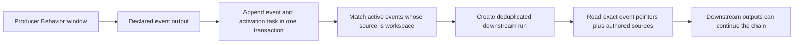

# Behaviors: activation, data, outputs, and chaining

This is the source map for Lobu's Behavior primitives. It describes what the
product supports now, how the pieces compose, and where a dedicated workflow
engine would still add something real.

## The core model

A Behavior is a versioned task owned by an agent. Its fields have separate
jobs:

| Primitive | What it decides | What it does not decide |
|---|---|---|
| Trigger | When a run starts | What durable context the run may read |
| Prompt and skills | What the agent should do | When it starts |
| Sources | What additional governed data a window reads | Whether new data activates it |
| Outputs | Which entity rows or append-only events a completed window persists | External side effects |
| Reaction or connector action | Which governed side effect follows analysis | The durable output contract |
| Run | Claiming, retries, busy policy, cooldown, audit, and status | Business meaning |
| ACL and approval policy | What the principal may read or change | Scheduling |

SQL sources are reads. A Behavior does not gain an ungoverned database-write
escape hatch by declaring SQL. Persisted changes go through declared outputs,
the ClientSDK, reactions, connector actions, and their existing ACL or approval
rails.

## Activation types

The `triggers` array is an OR: any matching trigger may start the Behavior. If
more than one trigger matches the same delivery, the first matching trigger's
execution and busy policy wins.

| Trigger | Use it for | Default execution | Busy default |
|---|---|---|---|
| No trigger | Explicit manual/API/SDK runs | Window | Existing run policy |
| `schedule` | Time-based analysis | Window | Coalesce |
| `event`, `source: "connector"` | Authenticated connector deliveries such as a Slack message or GitHub PR | Turn | Queue |
| `event`, `source: "workspace"` | A declared durable event output from another Behavior | Window | Coalesce |

`event` is one public trigger primitive; `source` records its provenance.
Existing connector triggers that omit `source` remain readable and normalize to
`source: "connector"` on write. Connector `behavior_events` are the allowed
catalog for connector-sourced events.
Connector feed `eventKinds` describe stored feed data and are not trigger
subscriptions. Entity-type `eventKinds` describe durable workspace semantics
and are the catalog for workspace-sourced events.

Sources never activate a Behavior. A subscription is the trigger declaration
that gives an event immediate activation semantics; it is not a second mutable
subscription record.

The UI mirrors this contract: choose **Event**, select either **Current
workspace** or an active connection as the **Source**, then choose one or more
catalog events in the searchable **Events** multi-select. New Event triggers
default to the current workspace. Its catalog combines the declared event kinds
in that organization; an optional entity-type filter lives under **Trigger
options** for the narrower case. One trigger may group events only when they
share the same source, filters, and run options.

## Behavior-to-Behavior chaining

Only newly persisted events from a declared Behavior output activate
events with `source: "workspace"`. Ordinary `save_memory` calls, connector ingestion,
and arbitrary rows already in `events` remain data. This explicit producer
boundary prevents every knowledge write from accidentally becoming a workflow
command.



The handoff is pointer-based. A signal carries the event ID, delivery ID, root
event ID, causal Behavior IDs, and depth—not a copied payload. Turn execution
reads the exact event once. Window execution adds the exact event IDs to the
same governed knowledge read as the authored sources and signs them into the
window token.

The output event and activation task commit atomically. The activation worker
runs after commit, makes up to five attempts, and uses the existing run queue for
claiming, backoff, idempotency, cooldown, dispatch, and Activity visibility.
Replaying the same completed output does not create another activation.

### Config example

```ts
const detectRisk = defineBehavior({
  agent,
  slug: "detect-risk",
  prompt: "Find material account risks. Emit observations with namespace account-risk.",
  triggers: [{ kind: "schedule", cron: "0 * * * *" }],
  sources: {
    accounts:
      "SELECT id, payload_text, metadata, occurred_at FROM events ORDER BY occurred_at DESC LIMIT 200",
  },
  outputs: {
    risks: { event: "observation" },
  },
});

const investigateRisk = defineBehavior({
  agent,
  slug: "investigate-risk",
  prompt: "Investigate the exact risk observation and recommend the next action.",
  triggers: [
    {
      kind: "event",
      source: "workspace",
      event_types: ["observation"],
      match: { namespace: "account-risk" },
      execution: "window",
      active_run: "coalesce",
    },
  ],
});
```

The downstream Behavior may also declare ordinary SQL sources. The triggering
events are included even when those sources return nothing.

## Delivery and safety semantics

- Exact metadata matching supports scalar string, number, boolean, and null
  values. It is not a general expression language.
- `queue` keeps each activation separate. `coalesce` combines pending inputs
  for one Behavior, with at most 25 exact event pointers per run; overflow
  creates another durable run instead of dropping data.
- One output event may fan out to at most 32 matching Behaviors. Exceeding the
  limit fails and retries the activation task instead of silently selecting a
  subset.
- Causal depth is capped at eight, with the root producer output at depth one.
  A Behavior already in the causal path cannot be re-entered, which prevents
  direct and indirect loops. Coalescing also stops before its inherited causal
  set would exceed 256 distinct Behaviors, bounding the durable signal size.
- Entity-scoped trigger inputs are checked against the downstream agent's read
  policy. Unbound inputs use the workspace-wide `$member` policy envelope.
- Connector delivery and workspace delivery share the public `event` primitive,
  but retain separate provenance values and internal activation paths because
  they cross different trust boundaries.
- External actions retain their connector authorization, approval, and
  idempotency behavior. Chaining does not make a side effect exactly-once.

## What this composes well

This model is enough for many ERP-style automations:

- sequential enrichment and review stages;
- conditional routing by event kind, entity type, and exact metadata;
- bounded fan-out to independent specialist Behaviors;
- scheduled reconciliation and exception detection;
- governed connector actions and approval-gated mutations;
- human-visible run history, retries, cooldowns, and durable outputs.

Use several small Behaviors when each stage has a meaningful durable output.
The append-only event between them becomes the audit boundary and replay point.

## What is not a first-class workflow primitive

Do not model these as if Lobu already had a general workflow instance engine:

- joining several branches behind a durable barrier;
- a correlated `wait until approval/notification answer X` step;
- deadlines, timers, and escalation attached to one workflow instance;
- compensation or saga rollback across external actions;
- arbitrary condition expressions, transforms, or visual data mapping;
- migrating an in-flight multi-step instance to a new definition version;
- unbounded loops, recursion, parallel maps, or reusable subflows;
- end-to-end exactly-once guarantees across third-party side effects.

Those features need an explicit workflow-instance identity and step-state
model. Adding them before a real use case would duplicate the existing run and
event primitives; pretending event chaining already provides them would be
equally misleading.

## Implementation source map

The earlier model was hard to audit because no document connected these
surfaces and the word “event” referred to several distinct contracts. Use this
map when changing the system:

| Concern | Source of truth |
|---|---|
| Public trigger/output schemas | `packages/core/src/contracts/tools/manage-behaviors.ts` |
| CLI authoring and apply mapping | `packages/cli/src/config/define.ts`, `packages/cli/src/commands/_lib/apply/` |
| Trigger normalization/catalog validation | `packages/server/src/behaviors/triggers.ts` |
| Workspace matching and causal limits | `packages/server/src/behaviors/workspace-event*.ts` |
| Queue, dedupe, coalescing, cooldown | `packages/server/src/runs/queue-service.ts` |
| Atomic output-to-task handoff | `packages/server/src/tools/admin/manage_behaviors/complete-window.ts` |
| Exact governed input reads | `packages/server/src/tools/get_content/` |
| Server/device dispatch | `packages/server/src/watchers/automation.ts`, `packages/server/src/worker-api/poll.ts`, Owletto Mac `BehaviorDispatcher.swift` |
| Web authoring and projection | Owletto `behavior-trigger-editor.tsx`, `lib/behaviors/model.ts` |
| Generated public client | `packages/client/src/generated/` |

The main documentation gaps were the missing primitive matrix, no end-to-end
activation trace, overloaded `event` terminology, and generated/API/UI sources
that had to be inspected independently. This page and the project template are
intended to keep the next audit source-directed.
