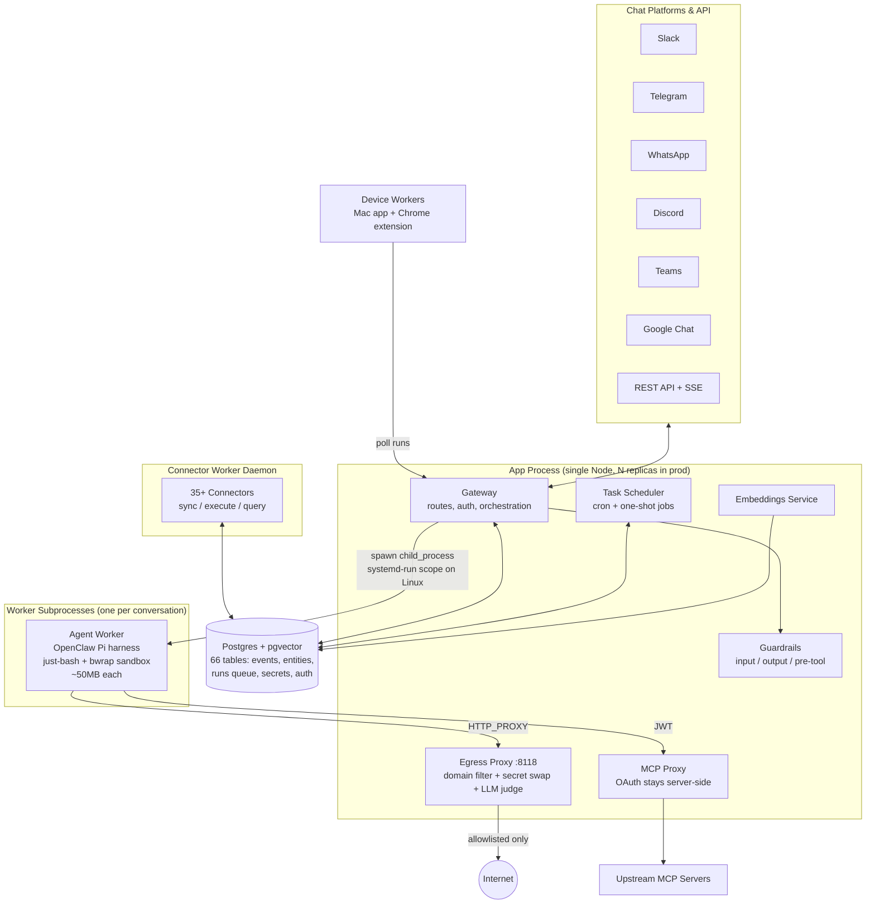
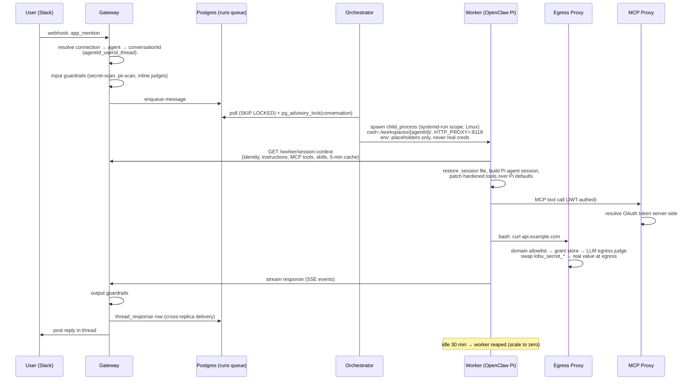
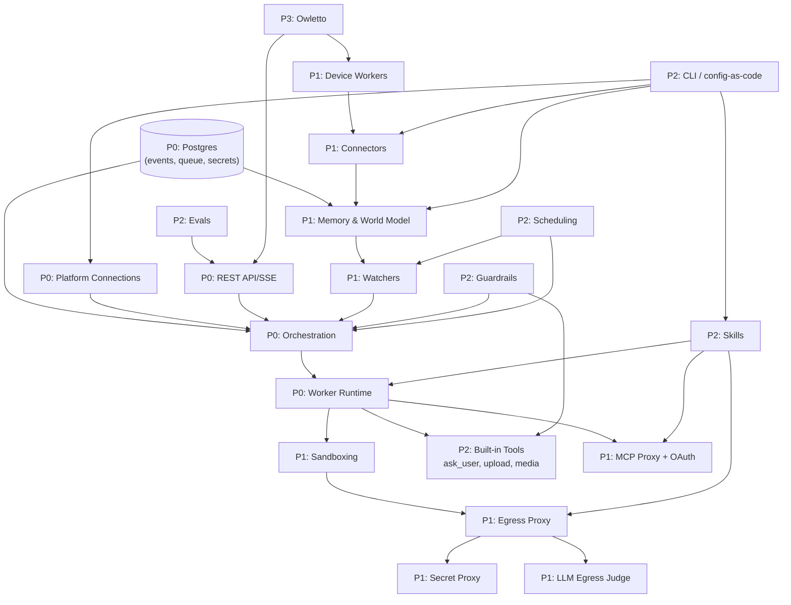
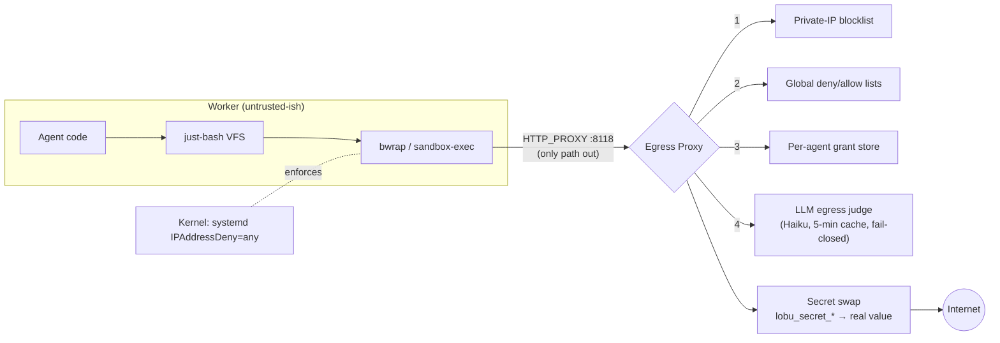

# Lobu: The Complete Feature Overview & Competitive Landscape

> An onboarding deep-dive for new team members. Everything Lobu does, ranked by priority,
> how the pieces fit together, where we're behind, and who we're up against.
> Compiled from a full codebase sweep (v11.1.0, June 2026) plus external market research.
> Estimated reading time: 3–4 hours.

---

## Table of Contents

1. [What Lobu Is (and Why It Exists)](#1-what-lobu-is-and-why-it-exists)
2. [The 30,000-Foot Architecture](#2-the-30000-foot-architecture)
3. [Life of a Message](#3-life-of-a-message)
4. [The Feature Catalog, Ranked by Priority](#4-the-feature-catalog-ranked-by-priority)
5. [How the Features Relate to Each Other](#5-how-the-features-relate-to-each-other)
6. [Deep Dive: The Gateway](#6-deep-dive-the-gateway)
7. [Deep Dive: The Worker Runtime](#7-deep-dive-the-worker-runtime)
8. [Deep Dive: The Security Stack](#8-deep-dive-the-security-stack)
9. [Deep Dive: Memory & the World Model](#9-deep-dive-memory--the-world-model)
10. [Deep Dive: Connectors & Device Workers](#10-deep-dive-connectors--device-workers)
11. [Deep Dive: CLI & Config-as-Code](#11-deep-dive-cli--config-as-code)
12. [Deep Dive: User-Facing Surfaces](#12-deep-dive-user-facing-surfaces)
13. [Deployment & Operations](#13-deployment--operations)
14. [Where We Are Lagging](#14-where-we-are-lagging)
15. [Competitive Analysis](#15-competitive-analysis)
16. [Strategic Synthesis](#16-strategic-synthesis)
17. [Your First Week: A Reading Path](#17-your-first-week-a-reading-path)
18. [Glossary](#18-glossary)

---

## 1. What Lobu Is (and Why It Exists)

**One sentence:** Lobu is an open-source, multi-tenant gateway that runs persistent,
sandboxed OpenClaw AI agents reachable from Slack, Telegram, WhatsApp, Discord, Teams,
Google Chat, and a REST API — with credentials the agents never see.

### The origin story

OpenClaw (launched November 2025 as "Clawdbot", renamed twice, now at 378k+ GitHub stars
and governed by an OpenAI-funded foundation) is the fastest-growing open-source project in
GitHub history. It is a full personal-agent runtime — but it is **explicitly single-tenant
by design**. Its own security docs state: *"OpenClaw is not a hostile multi-tenant security
boundary... If several people can message one tool-enabled agent, each of them can steer
that same permission set."* The official answer to "how do I run this for my team?" is
"run a second gateway on a different port."

That gap is real and well-documented:

- A multi-tenancy feature request (openclaw#61123) was closed with no commitment.
- A cottage industry of managed-OpenClaw hosts emerged ($9–$49/month per instance), all
  hosting **one instance per customer** — single-tenancy as a service.
- SecurityScorecard found **40,000+ exposed OpenClaw instances**, ~63% of a measured
  subset vulnerable to RCE; the ClawHub skills marketplace suffered a coordinated campaign
  ("ClawHavoc") planting 1,184+ malicious skills.

Lobu's bet: OpenClaw is ~800k LOC, but only the **gateway layer (~40k LOC)** needs to be
rewritten for multi-tenancy. Lobu rewrites that layer and keeps OpenClaw's Pi harness
untouched inside each worker. Every user/channel gets an isolated virtual filesystem and
bash session at **~50MB per instance** (just-bash + Nix, no Docker) — tested at 300
concurrent instances on a single machine. Lobu started as "Peerbot" (a Slack bot, summer
2025) and relaunched around February 2026 after integrating OpenClaw.

### The three claims that define the product

1. **Multi-tenant by construction.** One deployment serves many users, channels, and
   orgs. Each conversation gets its own worker, workspace, and session.
2. **Agents never see secrets.** Provider keys, OAuth tokens, and connection credentials
   live in the gateway. Workers see `lobu_secret_<uuid>` placeholders that the egress
   proxy swaps for real values only as traffic leaves.
3. **A single Node process + Postgres.** No Kubernetes required (though a Helm chart
   exists), no Docker required, embedded Postgres for zero-config local starts.

Keep these three in mind: almost every architectural decision in the codebase traces back
to one of them.

---

## 2. The 30,000-Foot Architecture

One app process runs **gateway + worker orchestrator + embeddings + memory**. Postgres
(with pgvector, optionally postgis) is the only external dependency. Workers are spawned
subprocesses; connectors run in a separate worker daemon.



### Package map

| Package | Role | Size/maturity |
| --- | --- | --- |
| `packages/server` | Gateway: connections, orchestration, routes, proxies, guardrails, scheduling | The heart; production |
| `packages/agent-worker` | Worker runtime: Pi harness embedding, tools, sandboxing | Production |
| `packages/core` | Shared types, guardrails framework, tracing, utils | Production |
| `packages/cli` | 17 commands: init/run/chat/apply/validate/memory/... | Production, refactor in flight |
| `packages/client` | OpenAPI-generated TS client | Auto-generated |
| `packages/connectors` | 35+ integrations (Google, LinkedIn, GitHub, Revolut, ...) | Production |
| `packages/connector-sdk` | `ConnectorRuntime` base class + browser automation helpers | Production |
| `packages/connector-worker` | Compiles (esbuild) and executes connectors | Production |
| `packages/embeddings` | Embedding HTTP service (Xenova local / OpenAI) | Production |
| `packages/pgvector-embedded` | Prebuilt pgvector binaries for embedded Postgres | Production |
| `packages/openclaw-plugin` | Memory plugin for vanilla OpenClaw installs | Production |
| `packages/promptfoo-provider` | Eval harness driving agents end-to-end | Production |
| `packages/owletto` | Admin SPA + Chrome extension + Mac app (private submodule) | Production |
| `packages/landing` | Marketing site (Astro) + docs + blog | Production |

### The multi-replica reality

This is drilled into every contributor and deserves a callout on day one:

> 🚨 **Prod runs N>1 app replicas behind ClientIP session affinity.** Per-pod state
> (`SseManager` event backlog, the in-process `workers` map, deploy-lock cache) is
> in-memory and pod-local. Cross-replica delivery rides Postgres (the `thread_response`
> queue). Platform responses are owner-routed (correct); **API/SSE responses are not** —
> an event broadcast on the wrong pod is silently dropped. This is a known gap.
> Never put shared state in an in-memory Map another replica must read.

---

## 3. Life of a Message

The single most useful mental model for a new engineer. Trace what happens when a user
types "@bot summarize this thread" in Slack:



Key invariants visible in this flow:

- **The conversation is the unit of isolation.** Worker, workspace, session file,
  advisory lock — all keyed on the conversation identity.
- **The gateway is the single egress.** Workers have no direct network; everything
  funnels through the proxy (policy) and, on Linux prod, kernel `IPAddressDeny=any`
  (enforcement).
- **State lives in Postgres, not in process.** The queue, the response routing, the
  locks. Anything else breaks at N>1 replicas.

---

## 4. The Feature Catalog, Ranked by Priority

Ranking criteria: **P0** = the spine — remove it and the product doesn't exist.
**P1** = the differentiators — why someone picks Lobu over the alternatives.
**P2** = supporting features — necessary for production quality, individually
replaceable. **P3** = emerging/partial — shipped or planned but not yet load-bearing.

### P0 — The Spine

| # | Feature | What it is | Where it lives |
| --- | --- | --- | --- |
| 1 | **Worker orchestration & scale-to-zero** | Spawn one OpenClaw worker per conversation, systemd-run hardening, idle reaping (30 min default), Postgres runs queue with advisory locks, cross-replica coordination | `server/src/gateway/orchestration/` |
| 2 | **OpenClaw/Pi worker runtime** | Embeds `pi-coding-agent` as the harness: multi-turn sessions, tool orchestration, `.session` persistence per thread, IDENTITY/SOUL/USER.md identity injection, per-agent model resolution | `agent-worker/src/openclaw/` |
| 3 | **Chat platform connections** | Slack (richest: threads, OAuth, app home, interactivity), Telegram (webhook/polling), WhatsApp, Discord, Teams, Google Chat, REST — all via Chat SDK adapters, created through UI/API (no per-platform env vars) | `server/src/gateway/connections/` |
| 4 | **REST API + SSE streaming** | Programmatic agent CRUD, messaging, config, connections; OpenAPI auto-generated; three auth paths (settings session, worker JWT, external OAuth/PAT) | `server/src/gateway/routes/` |
| 5 | **Postgres-as-the-runtime** | 66 tables; append-only `events`, runs queue, `thread_response` cross-replica delivery, encrypted secrets at rest, embedded Postgres + prebuilt pgvector for zero-config local | `db/migrations/`, `pgvector-embedded` |

**Why these are P0:** they are the product's claim — "multi-tenant OpenClaw." Every P1
differentiator assumes a worker was spawned for the right conversation, on the right
platform, with state in Postgres.

### P1 — The Differentiators

| # | Feature | What it is | Why it differentiates |
| --- | --- | --- | --- |
| 6 | **Gateway-held secrets (secret-proxy)** | Workers see `lobu_secret_<uuid>` placeholders; the proxy swaps real values at egress; failure rate-limiting; 24h TTL mappings | Only a handful of players do this (Cloudflare Sandboxes, microsandbox, Anthropic Managed Agents) — none open-source *and* full-platform |
| 7 | **Egress control + LLM judge** | 3-tier domain filtering (global deny → allow → per-agent grants), private-IP blocklists, plus an LLM judge (Haiku, 5-min cache, fail-closed) for natural-language network policies; kernel `IPAddressDeny` on Linux | The LLM egress judge has exactly one public peer (Brex's experimental CrabTrap). Kernel-level deny under the proxy is marketed by nobody else |
| 8 | **Lightweight sandboxing (~50MB)** | just-bash virtual FS + bwrap (Linux) / sandbox-exec (macOS) for spawned binaries + env stripping + Nix-provisioned tools. No Docker, no microVMs | Order-of-magnitude cheaper density than microVM rivals (E2B/Daytona/Fly). Honest caveat: policy boundary, not hard isolation — see §14 |
| 9 | **Memory & world model** | Typed entities + relationships (org-scoped, cross-org refs to public catalogs), append-only events with tombstoning, pgvector semantic search, auto-recall/auto-capture in the agent loop, memory flush on context pressure | Most runtimes have filesystem or KV memory; a temporal entity graph with schema-as-code is Letta/Zep territory, but integrated with the runtime |
| 10 | **MCP proxy + managed OAuth** | Workers discover MCP tools at startup, call via JWT-authed gateway proxy; OAuth/refresh lives in Lobu MCP servers; device-auth flows (`lobu_login`) from inside the conversation | "Integration auth stays server-side" is what Arcade/Nango sell as a whole company |
| 11 | **Connectors (35+) + device workers** | `ConnectorRuntime` SDK; sync feeds, live SQL pushdown, write actions; browser-automation connectors; device-pinned connectors run on the user's Mac/Chrome (Apple Health, LinkedIn) | Connectors feed the memory graph — the moat compounds: channels × memory × connectors |
| 12 | **Multi-tenancy & cloud mode** | Org-scoped everything (agents, memory, secrets, grants) via AsyncLocalStorage context; `LOBU_CLOUD_MODE=1` gates (webhook-only Telegram, Postgres connector blocked, block-private egress) | The founding wedge — nobody else makes OpenClaw multi-tenant at the gateway layer |
| 13 | **Watchers (proactive agents)** | Declarative triggers: schedule + prompt + extraction schema over data sources, optional reaction agent; windows/feedback tables for human correction | This is what makes agents *proactive* rather than reactive — the landing page's core promise |

### P2 — Supporting Features

| # | Feature | What it is |
| --- | --- | --- |
| 14 | **CLI & config-as-code** | `lobu init/run/chat/validate/apply` + 17 commands; `defineConfig/defineAgent/defineSkill/defineWatcher/defineEntityType` in `lobu.config.ts`; Terraform-style plan→confirm→apply diffs |
| 15 | **Skills system** | `SKILL.md` (YAML frontmatter + markdown): declares MCP servers, nix packages, network rules, judge policies; merged into system prompt + agent capability set |
| 16 | **Guardrails framework** | Stages input/output/pre-tool; built-ins (secret-scan, pii-scan, forbidden-tools) + inline LLM judges; fail-open on infra errors; every trip audited as a `guardrail-trip` event |
| 17 | **Scheduling & reminders** | Agent-facing `ScheduleReminder/ListReminders/CancelReminder` (cron + one-time); platform-facing TaskScheduler running 8+ periodic jobs (token refresh, embed backfill, watcher automation, sweeps) |
| 18 | **Human-in-the-loop (`ask_user`)** | Question + buttons posted to the platform; turn force-terminates; user's click resumes the session naturally; cross-replica delivery fixed in v11.1 |
| 19 | **Media & file tools** | `upload_file` (workspace-validated, 100MB cap), `generate_image`, `generate_audio` — all gateway-mediated with provider capability discovery |
| 20 | **Provider registry (16–40+)** | Config-driven (`config/providers.json`): Anthropic, OpenAI, Gemini, Groq, Bedrock, OpenRouter, DeepSeek, Mistral, xAI, Z.AI, ElevenLabs STT...; per-agent install/order; OAuth token auto-refresh |
| 21 | **Turn safety (runaway guards)** | Identical-tool-call loop blocking (>3×), total tool-call caps (50/turn), turn liveness timeouts, stalled-execution recovery |
| 22 | **Observability** | OpenTelemetry traces with W3C propagation, Sentry (classified provider failures), Prometheus + alert rules in Helm, failed-run metrics + dead-letter window (v11.1) |
| 23 | **Evals (promptfoo provider)** | Drives agents end-to-end via the public API; multi-turn transcripts, llm-rubric assertions, RAG context-recall via `result_summary` metadata |
| 24 | **Embedded runtime** | `lobu run` boots gateway + embedded Postgres (pgvector injected) + workers + embeddings in one process; install-operator bootstrap for headless first-run auth (v11.1) |

### P3 — Emerging / Partial / Planned

| # | Feature | Status |
| --- | --- | --- |
| 25 | **Owletto SPA + Chrome extension + Mac app** | Shipped (private submodule); agents UI, connections CRUD, memory browser; extension does content-script scraping (LinkedIn v11.1); Mac app is a device-worker + native-messaging bridge |
| 26 | **`lobu pull`** (cloud → config drift recovery) | Planned, design locked (v2.0 of the apply track) |
| 27 | **`lobu secrets push`** (value upload, fingerprint-only display, audit) | Planned (v3.0) |
| 28 | **CLI consolidation** (`lobu memory` namespace, kill `lobu dev`) | In flight, plan locked |
| 29 | **Warehouse connectors** (Snowflake, BigQuery), virtual feeds, federated search | Forward-compat hooks in place; Postgres connector v1 shipped v11.1 |
| 30 | **World-model expansion** (cross-org type pickers, catalog curation, contribution flow UI) | Shipped core + 8–10 outstanding items |
| 31 | **Events cold tiering** (archival) | Planning doc only |
| 32 | **Billing/entitlements** | Sketch only (Free/Pro/Enterprise gates in `database-connectors.md`); **no Stripe integration exists** |

---

## 5. How the Features Relate to Each Other

The features are not a list; they're a lattice. Three load-bearing relationships:

### 5.1 The dependency graph



### 5.2 The three compounding loops

**Loop 1 — The trust loop (security):**
sandboxing ⊂ egress proxy ⊂ secret proxy ⊂ guardrails. Each layer assumes the others:
the sandbox is "policy, not boundary" *because* a worker that escapes still holds no real
credentials and still can't reach un-allowlisted domains, and on Linux the kernel denies
raw IP egress anyway. Sell them together or not at all. This layered argument is the
counter to "but microVMs are harder isolation."

**Loop 2 — The knowledge loop (memory):**
connectors sync data → events + entities → embeddings → agent auto-recall → agent
auto-capture → more events → watchers extract & react → more structured entities.
Every connector added makes every agent smarter; every conversation enriches the graph
the next conversation reads. This is the data moat.

**Loop 3 — The surface loop (distribution):**
platforms × agents × orgs. One agent definition serves Slack and Telegram and the API;
one deployment serves N orgs. The CLI's `apply` makes the whole lattice reproducible as
code, which is what makes "agent infrastructure" credible to engineers vs. no-code
builders.

### 5.3 Where the value concentrates

If you ask "what would hurt most to lose?", the answer is **the gateway boundary
itself** — the fact that channels, secrets, egress, memory, and orchestration all meet in
one process you can self-host. Competitors have each piece (see §15); the integration is
the product.

---

## 6. Deep Dive: The Gateway

`packages/server` — the largest package, the one you'll touch most.

### Platform connections (`src/gateway/connections/`)

Every chat platform runs through Chat SDK adapters with a `ChatPlatformDescriptor`
registry — per-platform hooks for routing extraction, file handling, instruction
providers, webhook/command setup, and config guards. Connections are created via the
`/agents` UI or CRUD API; **no per-platform env vars**. Webhooks are the default
transport (don't add per-platform SDKs).

Platform-by-platform reality check:

| Platform | Transport | Files | Interactivity | Notes |
| --- | --- | --- | --- | --- |
| Slack | webhook + OAuth install | ✅ rich | ✅ buttons, app home | The flagship; manifest tooling in `scripts/slack-manifest.ts` |
| Telegram | webhook **or** polling (`mode: auto\|webhook\|polling`) | ✅ docs/voice | ✅ | Polling rejected when `LOBU_CLOUD_MODE=1`; webhook secrets coordinated cross-replica via `SELECT ... FOR UPDATE` |
| Discord | webhook | ✅ | basic | |
| Teams | webhook | ✅ | basic | |
| WhatsApp | webhook (Business Cloud API) | ❌ no file handler yet | basic | |
| Google Chat | webhook | ❌ no file handler yet | basic | |
| REST | first-class adapterless platform (v11.0) | ✅ | via SSE | |

`InteractionService` events carry a `platform` field; **each renderer filters on its own
identity** — never another's. This is the platform-isolation rule in AGENTS.md.

### Orchestration (`src/gateway/orchestration/`)

- `MessageConsumer` polls the single Postgres `messages` queue with `SKIP LOCKED`,
  coalesces concurrent deployment creation in-pod via an in-flight promise map, and
  serializes cross-pod via `pg_advisory_lock` per conversation.
- `BaseDeploymentManager` → `embedded-deployment.ts` spawns workers as `child_process`
  with, on Linux, `systemd-run --user --scope`: 512MB memory, 200% CPU, 64 tasks,
  `IPAddressDeny=any` (allow loopback), dropped capabilities, nofile 1024. macOS dev
  falls back to plain spawn (proxy is best-effort there).
- Idle workers reaped after `idleCleanupMinutes` (default 30). A `// TODO` remains on
  PID-based idle tracking (currently last-activity timestamps).
- Turn liveness: timeout arming + stalled-execution recovery jobs.

### Routes

Public API covers agent CRUD/chat/SSE/status/config/restart, connection CRUD + manual
webhook test, OAuth (register, provider authorize/callback, Slack install), files,
channels, Slack events/interactivity, MCP provider OAuth. Zod schemas + auto-generated
OpenAPI (`routes/openapi-auto.ts`) feed the generated `packages/client`.

Auth is unified across three paths in `api-auth-middleware.ts`:
1. **Settings session** (cookie, better-auth, passkeys supported)
2. **Worker token** (short-lived JWT scoped to its own agentId, revocation list)
3. **External OAuth / PAT** (device-code flow, `LOBU_API_TOKEN` for CI)

Tenant guards verify org context against agent ownership — defense against cross-tenant
access through shared agent IDs.

### Scheduling (`src/scheduled/`)

A Postgres-backed task scheduler runs the platform's metabolism: token refresh (30m),
MCP session cleanup (10m), ephemeral table sweeps (5m), stalled-execution checks (5m),
embed backfill (5m), classification reconciliation (5m), **watcher automation (1m)**,
notification dispatch. One-shot tasks use idempotency keys.

### LLM providers (`src/gateway/auth/` + `config/providers.json`)

A `ModelProviderModule` registry: install/uninstall/reorder providers per agent,
reverse-lookup provider from model string, per-provider secret env names, OAuth profile
lifecycle with lazy + periodic refresh. The catalog covers Anthropic, OpenAI, Gemini,
Groq, Together, Fireworks, OpenRouter, Cerebras, NVIDIA, xAI, DeepSeek, Mistral, Cohere,
Perplexity, Z-AI, ElevenLabs (STT), and more. Org-shared provider keys resolve at the
egress proxy (#1215).

---

## 7. Deep Dive: The Worker Runtime

`packages/agent-worker` — where the agent actually thinks.

### The Pi harness

Workers embed `@mariozechner/pi-coding-agent` (the OpenClaw harness). Lobu's
`buildAgentSession()` wraps Pi's `createAgentSession()` and then **patches hardened
versions of the built-in tools** (read/write/edit/bash/grep/find/ls) over Pi's defaults —
adding env stripping, gateway-proxy routing, and bash policy. The session file
(`.session`, Pi's binary format) persists the full message branch per conversation under
`./workspaces/{agentId}/{conversationId}/`, alongside `input/`, `output/`, and the
identity files (`IDENTITY.md` persona, `SOUL.md` long-term context, `USER.md` profile).

Session context comes from the gateway (`/worker/session-context`, 5-min cache,
invalidated on `config_changed`): instructions, platform rules, MCP tool definitions,
skills, provider config. `replaceBasePromptIdentity()` swaps Pi's "expert coding
assistant" opener for the agent's declared identity.

### Built-in tools (snake_case, registered in `custom-tools.ts`)

| Tool | Behavior |
| --- | --- |
| `ask_user` | Posts question + buttons via `/internal/interactions/create`, then **force-ends the turn** (abort signal). The button click arrives as a new message and the session resumes from disk. Guards against weak models re-asking in a loop |
| `upload_file` | realpath-validated to workspace, 100MB cap, multipart to gateway, returns permalink |
| `generate_image` / `generate_audio` | Capability discovery first, then gateway-routed generation + upload with provider attribution |
| `get_channel_history` | Cursor-paginated platform history; requires explicit `platform` |
| `lobu_login` / `lobu_login_check` / `logoutMcp` | Per-MCP device OAuth from inside the conversation |
| MCP tools | Discovered at startup, namespaced `{mcpId}/{toolName}`, called via JWT proxy; retrieval tools return `result_summary` for RAG eval assertions |

### Sandboxing layers (worker side)

1. **just-bash** — interpreter-level virtual FS rooted at the workspace; loop/depth caps
   (50k commands/iterations, depth 50); network access only via proxy-aware commands.
2. **Spawned-binary sandbox** — `bwrap` on Linux (unshared user/PID/IPC/UTS/net
   namespaces, workspace rw, /usr/lib ro), `sandbox-exec` deny-default SBPL on macOS
   (denies ~/.ssh, ~/.aws, keychains); probed at startup, fails closed if unavailable.
3. **Env stripping** — `SENSITIVE_WORKER_ENV_KEYS` removed before any child process.
4. **Binary discovery** — `/nix/store/*` tools registered as just-bash custom commands;
   unsandboxed interpreters (node, python, ...) filtered unless explicitly allowed.
5. **Tool policy** — blocks imperative package managers (`npm install`, `pip install`,
   `apt`, `nix`) — packages are declarative via `nixPackages`; blocks direct
   `curl $DISPATCHER_URL/internal/...` gateway calls with a pointed error message.

### Memory in the loop

The OpenClaw plugin auto-recalls up to 6 relevant memories before each prompt (8s budget)
and auto-captures decisions/facts after sessions, stamped with `agent_id`. When context
nears the limit (~4k-token soft threshold), the worker pauses the turn and prompts the
agent to `save_memory` before compaction — durable memory survives; context doesn't.

### Turn safety

`TurnController` wraps every tool: identical call >3× → abort; >50 tool calls/turn →
abort; `ask_user` posted → abort (by design). Combined with gateway-side liveness
timeouts, this is the answer to "what stops a runaway agent from burning $500 of tokens."

---

## 8. Deep Dive: The Security Stack

The defining design: **assume the sandbox leaks; make the leak worthless.**



- **Secret proxy** (`gateway/proxy/secret-proxy.ts`): placeholder mappings have 24h TTL,
  cascade-delete on teardown, failure rate-limiting (20 failures/5min throttles).
- **Egress judge** (`gateway/proxy/egress-judge/`): natural-language network policies
  per agent/skill ("Allow only reads to channels in the agent's context"), circuit
  breaker, decision cache keyed by domain + context hash.
- **Guardrails** (`core/src/guardrails/` + `gateway/guardrails/`): input/output/pre-tool
  stages; agent-enabled built-ins + skill-declared + inline judges; dedup per stage with
  agent entries winning; **fail-open on infra errors** (a deliberate availability trade —
  enterprise vendors like Lakera sell fail-closed as the feature; we may need the option).
- **Threat model honesty** (`docs/SECURITY.md`): just-bash and isolated-vm are *policy*,
  not security boundaries for hostile code. An agent granted `nixPackages: ["nodejs"]`
  has code exec by design (binaries are declared capabilities). macOS `HTTP_PROXY` is
  advisory. For hostile-tenant threat models, deploy Lobu inside stronger isolation
  (per-tenant VM, gVisor, Firecracker).

Why this is defensible anyway: a sandbox escape yields a process that (a) holds zero real
credentials, (b) can only reach allowlisted domains through the proxy, and (c) on Linux
can't make raw IP connections at all. The boundary isn't one wall; it's the composition.

---

## 9. Deep Dive: Memory & the World Model

This is the subsystem most undersold by the README and most strategically important.

### The primitives

- **Entities** — typed, org-scoped rows (`person`, `company`, `asset`, `$member`,
  custom types via `defineEntityType`). Types can be **stored** or **derived** (backed by
  a SQL view, optionally over an external connection — live reads, no copy).
- **Relationships** — typed edges with cardinality rules.
- **Events** — the append-only log. `events` is **never deleted**; corrections happen by
  writing a superseding tombstone (`save_knowledge({ supersedes_event_id })`);
  `current_event_records` masks superseded rows. Semantic types per entity class
  (fact, note, todo, decision, identity, preference, observation, valuation,
  transaction...).
- **Embeddings** — pgvector vectors per event, backfilled every 5 minutes, model
  swappable per agent (`text-embedding-3-small`, local Xenova), with a no-embedding SQL
  search fallback.
- **Identities** — cross-platform entity deduplication (the same person via Gmail,
  LinkedIn, Slack).

### Cross-org world model (`docs/plans/world-model.md`, shipped core)

Two org types: **tenant** (private) and **public_catalog** (curated knowledge).
References flow one way only: tenant → public. Vocabulary (entity types) resolves via
schema search path. Agent templates live as entities in the public catalog;
installation is a small INSERT. ~8–10 expansion items remain (type pickers, catalog
curation UI, contribution flow).

### Watchers — the proactive layer

`defineWatcher({ slug, agent, schedule, prompt, extractionSchema, sources, reaction })`:
on schedule, run named SQL sources over the memory/feeds, have an LLM extract structured
fields, optionally invoke a reaction agent. Windows, per-field feedback, and versioning
are all first-class tables. This is how "an agent that watches your inbox and files your
expenses" actually works — and it's the feature that justifies the word *proactive* in
the positioning.

### How memory reaches the agent

Via the Lobu MCP server: `save_memory`, `search_memory`, `query_sql`, `query_sdk`,
`run_sdk`, plus the auto-recall/auto-capture loop described in §7. The same MCP server is
installable into **vanilla OpenClaw** via `packages/openclaw-plugin` — a deliberate
bridge product for the existing OpenClaw user base.

---

## 10. Deep Dive: Connectors & Device Workers

### The connector model

`*.connector.ts` extends `ConnectorRuntime<Checkpoint, Config>` with:
- `sync()` — incremental reads into memory feeds (checkpointed, streaming emits)
- `execute()` — write actions (low-risk inline; destructive requires in-thread approval)
- `query()` — live reads powering derived entities and `query_sql` pushdown
- `authenticate()` — interactive auth (QR codes, pairing, OAuth, browser sessions)

npm deps bundle via esbuild at compile time (`lobu apply` compiles on the CLI); native
deps declare `runtime.nix.packages` provisioned by nix-shell at run.
`@lobu/connector-sdk` is externalized (runtime-provided).

### The catalog (35+)

Google (Calendar, Gmail, Play Store), Microsoft Outlook, Apple (Health, Photos, Screen
Time), LinkedIn, Reddit, X, YouTube, Spotify, WhatsApp (incl. raw local DB), Telegram,
Hacker News, Trustpilot, G2, Glassdoor, Capterra, Product Hunt, Revolut, GitHub, Chrome
(bookmarks/history), local Postgres, RSS, websites, local directories...

### Device workers — the underrated wedge

The Mac app + Chrome extension act as **device-pinned workers**: they poll for runs
pinned to the user's device and execute connectors *on the user's hardware with the
user's sessions* — Apple Health data that never leaves the laptop, LinkedIn scraped via
the user's own logged-in Chrome (content-script, v11.1, replaced the Playwright
fallback). Pairing rides Chrome native messaging → Mac app → Keychain → child PAT mint.
No surveyed competitor has this user-device data plane.

### Connectors vs. MCP — when to use which

MCP = real-time tool calls to services with server-side OAuth (act now).
Connectors = scheduled data ingestion into the memory graph + live SQL pushdown (know
things). A team's blog post argues skills/MCP are "too primitive" for data — raw
connectors with checkpoints and feeds are the answer for ingestion.

---

## 11. Deep Dive: CLI & Config-as-Code

The CLI (`@lobu/cli`, 17 commands) is the developer front door:

```
lobu init my-bot          # scaffold: lobu.config.ts, SOUL/IDENTITY/USER.md, .env
lobu run                  # embedded gateway + Postgres(pgvector) + workers + auto-apply
lobu chat -c local "hi"   # talk to it
lobu validate             # schema-check config against connector/entity schemas
lobu apply --dry-run      # Terraform-lite: plan → confirm → idempotent converge
lobu login / org / link   # device-code auth, org context, project binding
lobu connector run gmail  # exec a connector locally against an auth profile
lobu memory run search_memory '{"query": "..."}'
lobu doctor               # env health checks
```

The `lobu.config.ts` API is the product's IaC surface:

```ts
export default defineConfig({
  org: "acme",
  agents: [defineAgent({
    id: "support",
    dir: "agents/support",          // SOUL.md, IDENTITY.md, USER.md
    skills: [skillFromFile("skills/triage/SKILL.md")],
    network: { allow: ["api.github.com"], judge: ["*.slack.com"] },
    guardrails: ["secret-scan", "pii-scan"],
    nixPackages: ["jq", "pandoc"],
    mcpServers: { github: { url: "...", type: "streamable-http" } },
    platforms: { slack: {...}, telegram: {...} },
  })],
  entities: [defineEntityType({ ... })],          // memory schema
  connections: [defineConnection({ connector: "gmail", authProfile: "..." })],
  watchers: [defineWatcher({ schedule: "0 8 * * *", prompt: "...", reaction: {...} })],
  authProfiles: [defineAuthProfile({ kind: "oauth_account", ... })],
});
```

Safety gates worth knowing: apply refuses unlinked projects without `--force`, confirms
deletions over blast-radius 3, detects shared/prod `DATABASE_URL` and demands
`--unsafe-shared-db`, and **data is never pruned** (only definitions).

The roadmap (plans locked): `lobu pull` (cloud→config, drift recovery), `lobu secrets
push` (values up, fingerprints only ever displayed), and the `lobu memory` namespace
consolidation.

---

## 12. Deep Dive: User-Facing Surfaces

- **Owletto SPA** (private submodule): agents CRUD, connections, settings, memory
  browser. Self-hosters without the submodule get a headless API-only build.
  `DESIGN_GUIDELINES.md` is mandatory reading before UI changes.
- **Chrome extension**: gateway pairing persisted via pinned manifest key;
  content-script scraping (LinkedIn home feed); entity browsing.
- **Mac app (Owletto.app)**: menubar popover, Keychain creds, native-messaging bridge,
  device-worker polling, reads `~/.config/lobu/config.json` for worktree contexts.
- **Landing** (`packages/landing`, Astro): outcome-first homepage (v10.2), `/for/*`
  use-case pages, 8 blog posts establishing technical voice (sandboxing OpenClaw, prompt
  injection defenses, MCP-overengineered, filesystem-vs-database memory, secrets
  management). Style rule: no em dashes in user-facing copy.
- **Install-operator bootstrap** (v11.1): first boot creates an `install_operator` user
  whose password *is* `hashPassword(ENCRYPTION_KEY)` — headless CI/container setup with
  one env var; SPA first-login accepts the key then enrolls a passkey.

---

## 13. Deployment & Operations

| Mode | How | Notes |
| --- | --- | --- |
| Local dev | `make dev` / `lobu run` | Embedded Postgres + pgvector, Vite HMR :8787 |
| Single VM | `node server.bundle.mjs` + `DATABASE_URL` | The recommended simple prod |
| Docker | `ghcr.io/lobu-ai/lobu-app` single image | amd64 native; arm64 via emulation |
| Kubernetes | `helm install lobu oci://ghcr.io/lobu-ai/charts/lobu` | app/worker/embeddings deployments, ServiceMonitor, PrometheusRule, PDBs, migration Job |
| Lobu Cloud | managed, `LOBU_CLOUD_MODE=1` | Usage-based (Railway-style compute rates, scale-to-zero, idle = $0); **no billing code in repo yet** |

Release engineering: release-please owns versions — conventional commits on `main`,
merge the release PR, CI publishes via OIDC. Inter-package deps must be `workspace:*`.
Monthly-ish release cadence; v11.1.0 shipped 10 features + 15 fixes including a security
audit round, guardrails execution wiring, and cross-replica delivery for ask_user
buttons.

Validation culture: `make review` (typecheck/unit/integration + pi verdict) after
changes; **E2E red→fix→green reproducer is a hard gate for bug-fix PRs**; bot behavior
via `scripts/test-bot.sh`; prompt behavior via promptfoo evals; browser flows via the
agent-browser harness.

---

## 14. Where We Are Lagging

Honest internal assessment, ordered by how much they matter. Sources: TODOs and gap
notes found in code, `docs/plans/`, AGENTS.md warnings, and judgment calls from the
competitive scan.

### Tier 1 — Architecturally significant

1. **API/SSE multi-replica routing gap.** Platform responses are owner-routed via
   Postgres; API/SSE responses are not — an event on the wrong pod is silently dropped.
   Today it's papered over with ClientIP session affinity. Any serious API customer
   running N replicas will hit this. The fix direction is known (Postgres-mediated
   signal/fan-out); it needs to be built.
2. **Isolation boundary vs. the market narrative.** Competitors (E2B, Daytona, Fly
   Sprites, microsandbox, Cloudflare) sell hardware-grade microVM/gVisor isolation.
   Our just-bash + bwrap layer is honest-by-docs "policy, not boundary." The layered
   defense (no secrets + egress proxy + kernel deny) is a real argument, but (a) macOS
   dev is weaker (advisory proxy, no bwrap), (b) `nixPackages: ["nodejs"]` grants code
   exec by declaration, and (c) enterprise security reviews pattern-match on "microVM."
   Consider: optional pluggable worker substrate (Firecracker/gVisor/Sprites backend)
   for the tenants who need it — Anthropic's own hosting docs list exactly those options.
3. **No billing/entitlement system.** Lobu Cloud is positioned publicly (usage-based,
   scale-to-zero) but the repo has no Stripe/metering/entitlement code — only a sketch in
   `database-connectors.md`. If cloud is the business model, this is the longest lead
   item not yet started.
4. **Owletto as a private submodule.** Self-hosters get a headless build by default;
   the full OSS story has an asterisk. Competitors like n8n win on "clone and get the
   whole product." Worth a deliberate decision: open it, or productize headless+CLI as
   the real OSS surface.

### Tier 2 — Production-hardening debt

5. **MCP proxy hardening**: no circuit breaker; tool-discovery cache not org-isolated
   (cache-key collision risk across orgs).
6. **Scheduler/job observability**: no stuck-job dashboard, no dead-letter UI (a
   dead-letter *window* shipped v11.1; surfacing it didn't).
7. **Egress judge cache key** is domain + context hash only — method/path-insensitive;
   different request types to one domain share a cached verdict.
8. **Embedding model swaps** don't re-index old vectors; old-model vectors persist
   silently.
9. **Worker workspace GC**: no garbage collection of old session directories (TODO).
10. **Memory-flush hang risk**: if a model ignores the "store memories now" prompt, the
    turn can stall (mitigated by model quality, not by code).
11. **No DNS/TLS hardening on the proxy** (no DNSSEC, no cert pinning).
12. **Guardrails catalog is thin**: secret-scan/pii-scan/forbidden-tools exist, but no
    rate-limit, token-budget, or cost guardrails; fail-open is the only mode.

### Tier 3 — Feature/market gaps (vs. §15 competitors)

13. **Channel gaps**: WhatsApp/Google Chat lack file handlers; no voice/phone surface at
    all (Lindy's differentiator); no email-as-channel (Lindy, Agentuity); OpenClaw itself
    supports 22 channels including Signal/iMessage/Matrix — we cover 6+REST.
14. **No evals UX**: promptfoo provider exists, but there's no `lobu evals` command, no
    hosted eval dashboard (LangSmith is best-in-class here and OpenAI literally points
    its deprecated-Evals users at promptfoo — an integration opportunity).
15. **Observability story vs. LangSmith/AgentCore**: we have OTel + Sentry + Prometheus,
    but no agent-trace UI a customer can see (tool-call timelines, token costs per
    conversation/org).
16. **No cost/quota tracking per org/agent** — table stakes for both cloud billing and
    enterprise chargeback.
17. **Enterprise identity**: no SSO/SAML/SCIM mentions, no MFA documented, no
    per-agent workload identity (the market is moving to Okta-for-agents / SPIFFE /
    MCP XAA — supporting these aligns with where enterprise buyers are heading).
18. **No agent template marketplace** — the world-model groundwork (public_catalog,
    agent_template entities) exists, but no UX; meanwhile ClawHub's malicious-skill
    fiasco makes "curated, sandboxed templates" an easy trust story.
19. **Compliance posture**: no SOC 2 / HIPAA claims anywhere; Dust, CrewAI, Blaxel all
    wave certifications at enterprise buyers.
20. **Distribution/traction**: ~162 GitHub stars, no Show HN, no press of our own while
    the OpenClaw ecosystem floods with hosting offers and wrapper projects
    (openclaw-multitenant, Clawbake, ClawTeam, Eve, Klaus). The product is ahead of its
    awareness.

---

## 15. Competitive Analysis

The landscape splits into five rings, from most-adjacent to least. The recurring
conclusion from the research: **every individual Lobu mechanism now has a peer
somewhere; the integrated bundle — open-source + self-host + chat gateway + gateway-held
secrets + LLM egress judge + memory graph + scheduling — exists nowhere else.**

### Ring 1: The OpenClaw ecosystem (the home turf)

| Player | What | Threat level |
| --- | --- | --- |
| **OpenClaw itself** | 378k+ stars, foundation-governed, OpenAI-funded; explicitly single-tenant; 22 chat channels | Frenemy. Upstream churn risk + the foundation could bless a multi-tenant story someday. Today, their docs *are* our pitch |
| **Managed hosts** (BetterClaw $19/mo, xCloud $24, ClawHosted $49, Elestio, DO, Eve, Klaus) | One VM/container per customer | Validates demand; economically crude (always-on instance per user vs. our 50MB scale-to-zero workers). Eve's HN launch had a cross-tenant security hole — isolation pitches sell |
| **openclaw-multitenant (OCMT)** | Fork adding Docker sandboxes per session + group vault; 47 stars | Closest OSS rival in spirit; fork-the-runtime approach means they chase 800k LOC upstream forever — our gateway-rewrite approach is the structural advantage |
| **Security incidents** | 40k+ exposed instances, 63% RCE-vulnerable subset, ClawHavoc (1,184 malicious skills) | Our best marketing material. "Multi-tenant OpenClaw, where the agent never sees a secret" answers the headline directly |

### Ring 2: Full-platform rivals (the real fight)

| Player | Shape | They're stronger | We're stronger |
| --- | --- | --- | --- |
| **Cloudflare Agents SDK / Project Think** (Apr 2026) | Durable Objects per agent, SQLite state, scheduling, MCP, V8 sandboxes with capability grants, Outbound Workers doing **network-layer credential injection** ("the agent never sees the token"), channels incl. Slack/email/voice | Edge scale, near-zero idle cost, ecosystem | 100% their cloud — no self-host, no your-Postgres; no LLM egress judge; no PII guardrail stages; primitives not product. Pitch: *"Project Think on your own infrastructure, with a chat gateway"* |
| **AWS Bedrock AgentCore** (GA Oct 2025) | Runtime + Gateway + **Identity (token vault)** + Memory + Browser/Code-Interpreter — maps ~1:1 to Lobu | Enterprise trust, compliance, scale | AWS-only; ~12 billable meters ($0.25/1k memory events!); no chat gateway at all; our single-process+Postgres is the anti-complexity counter. Their architecture is the strongest *validation* of ours |
| **Azure Foundry Agent Service** | Hosted agents (can even run Claude-SDK/LangGraph containers), per-agent Entra identity, VM sandboxes, Teams/M365 channels | Microsoft-shop distribution, identity depth | Azure-locked, preview-grade, metered memory, Teams-centric (no Slack/Telegram/WhatsApp) |
| **Anthropic Claude Managed Agents** (beta) | Hosted REST agents on the same SDK lineage we build on; vault credential proxy; self-hosted sandbox option | Owns the harness; zero hosting work | No chat channels, no semantic memory, no cron, no guardrail pipeline, control plane not self-hostable. Their hosting docs *prescribe our exact architecture* — "the reference architecture, productized" |
| **Agentuity** ($4M seed) | Agent-native cloud: runtime+sandbox+storage+channels+cron | Polished DX, framework-agnostic | Closed, seed-stage; our OSS self-host + secrets story |
| **OpenAI ChatGPT Workspace Agents** (Apr 2026, pricing July 6 2026) | Codex-powered shared org agents in ChatGPT + Slack | Massive distribution | OpenAI platform churn is brutal (Assistants API dead Aug 2026; Agent Builder + Evals dead Nov 2026) — "build on stable, open ground" is an honest angle |

### Ring 3: Chat-platform agent products (compete for the same buyer)

| Player | Pricing | Take |
| --- | --- | --- |
| **n8n** ($5.2B val., SAP-backed, 192k stars) | Free self-host CE; cloud from €20/mo | **The question every prospect asks: "why not n8n?"** Answer: workflow engine vs. agent runtime — n8n agents are stateless workflow runs around an LLM node; no persistent sandboxed sessions, no semantic memory, no secret-proxy/egress, fair-code not OSS |
| **Dust.tt** ($40M Series B May 2026, 3k orgs) | €29/seat/mo | Closest on "team agents in Slack"; RAG-first, SaaS-only, no code sandbox, per-seat |
| **Lindy** (~$50M raised) | $49–199/mo, opaque credits | Prosumer polish + voice/phone + computer-use; their Autopilot runs with your live creds in their cloud — our secret-isolation contrast |
| **Zapier Agents** | ~free–$20/mo activities | 8,000-app graph; glorified multi-step Zaps, pure SaaS |
| **Salesforce Agentforce/Slack** | $125–550/user/mo + Flex Credits | Owns the Slack surface (platform-dependency risk for us too); locked, metered, no code exec |
| **Copilot Studio** | $200/25k credits; autonomous triggers 25 credits *each* | Punishes exactly the always-on scheduled agents we make free at the margin |
| **StackAI** | — | Acquired by Asana (May 2026) for $75M; consolidation signal + churn opportunity |

### Ring 4: Substrates (compete only with our worker layer)

E2B ($21M A, ~$0.10/hr/sandbox), Daytona ($24M A, AGPL), Modal ($4.65B, GPU-first),
Fly Sprites (persistent per-agent computers + static egress allowlists), Morph (VM
branching), Blaxel, Northflank, Vercel Sandbox. None hold secrets away from the
workload; none own channels; none ship memory/cron/MCP-OAuth. Several now match
"persistent + scale-to-zero," so **our defensible ground is the gateway, not the
sandbox** — and any of them could become an optional Lobu worker substrate (frame Fly/
microsandbox as partners as much as rivals).

### Ring 5: Frameworks & memory layers (build-vs-buy alternatives)

- **LangGraph Platform/LangSmith**: best observability/evals in the industry; runtime
  semantics rival ours; but no chat channels, no sandbox/egress/secrets, self-hosted
  platform is enterprise-paywalled.
- **Letta** (MemGPT): philosophically closest OSS — stateful agent server + Postgres +
  **Channels beta (Telegram/Slack/Discord/WhatsApp)**. Watch closely. Weaker on
  isolation/egress/secrets; channels beta is one-agent-per-app, no Teams.
- **Zep/Graphiti**: temporal knowledge-graph memory — a component, not a competitor;
  also the bar our memory subsystem gets judged against.
- **CrewAI** (enterprise $60–120k/yr est., "FedRAMP High" claims): workflow executions,
  not persistent agents; enterprise sales motion we lack.
- **Microsoft Agent Framework** (AutoGen+SK merged), Pydantic AI, Mastra, Inngest:
  libraries — the DIY path whose total cost is our sales argument.

### The security-stack scorecard

| Capability | Lobu | Cloudflare | microsandbox | Anthropic MA | CrabTrap | E2B/Daytona |
| --- | --- | --- | --- | --- | --- | --- |
| Secrets never in workload | ✅ | ✅ | ✅ | ✅ | ❌ | ❌ |
| LLM egress judge | ✅ | ❌ | ❌ | ❌ | ✅ (experimental) | ❌ |
| Domain allowlist egress | ✅ | ✅ | ✅ | ✅ | ✅ | partial |
| PII/secret guardrail stages | ✅ | ❌ | ❌ | ❌ | ❌ | ❌ |
| Multi-tenant chat gateway | ✅ | partial | ❌ | ❌ | ❌ | ❌ |
| Semantic memory graph | ✅ | partial (SQLite) | ❌ | ❌ | ❌ | ❌ |
| Open-source self-host | ✅ | ❌ | ✅ (runtime only) | ❌ | ✅ (proxy only) | partial |
| Hardware isolation (microVM/gVisor) | ❌ | ✅ | ✅ | ✅ | n/a | ✅ |

That last row is our only ❌ — and the first row is most of theirs.

---

## 16. Strategic Synthesis

### The five competitors that matter most

1. **Cloudflare (Project Think)** — only player assembling sandbox + credential
   injection + scheduling + channels. Counter: sovereignty + self-host + judge +
   product-vs-primitives.
2. **n8n** — wins the "self-hosted automation" mindshare battle by default. Counter:
   agent runtime vs. workflow engine; security model; persistent memory. Every piece of
   content should anticipate this comparison.
3. **Anthropic (Managed Agents + SDK)** — same harness lineage, infinite distribution.
   Counter today: channels/memory/cron/self-host. Risk horizon: 12 months.
4. **Letta** — OSS stateful server + chat channels beta. The most likely "looks like
   Lobu" pitch in 2027. Counter: security stack + connectors + multi-tenancy depth.
5. **AWS AgentCore / Azure Foundry** — where enterprise deals go to die by default
   vendor. Counter: 1 process + 1 database vs. 12 meters; no chat gateway on their side.

### Market gaps worth exploiting

- **The OpenClaw security crisis is unanswered demand.** 40k exposed instances and a
  poisoned skills marketplace, with the official guidance being "run more gateways."
  A "secure team OpenClaw in 10 minutes" motion (content + Show HN + the openclaw-plugin
  bridge for existing users) attacks this directly. Traction (162 stars) is the
  bottleneck, not the product.
- **Autonomous/scheduled agents are punished by every metered competitor** (Copilot's
  25-credits-per-trigger, Lindy credits, Zapier activities, AgentCore memory meters).
  "Flat infra, your keys, idle = $0" is the clean counter-position.
- **Per-seat pricing fatigue** (Dust €29/seat, Agentforce $125+/user) vs. our
  per-compute model.
- **Consolidation** (Asana←StackAI, SAP→n8n, Salesforce AgentExchange, Workday←Pipedream)
  strengthens the independent self-hosted option — and creates displaced-customer
  moments.
- **Standards wave**: MCP enterprise auth (XAA/ID-JAG), Okta-for-agents, SPIFFE
  workload identity — early support would differentiate with security-conscious buyers.

### Table stakes we're missing (priority order)

1. Fix API/SSE cross-replica delivery (it undermines the "multi-replica correct" claim).
2. Per-org/agent cost & usage tracking (prerequisite for cloud billing *and* enterprise).
3. An agent-trace/eval UI (or deep LangSmith/promptfoo integration + docs).
4. Optional hardened worker substrate (gVisor/Firecracker/partner-cloud) for
   enterprise threat models.
5. SSO/SAML + audit-log surfacing for the enterprise checklist.
6. Voice/email channels (or an explicit "not our segment" decision).

---

## 17. Your First Week: A Reading Path

**Day 1 — feel the product.** `npx @lobu/cli@latest init my-bot && lobu run && lobu chat
-c local "hello"`. Then connect a Slack or Telegram bot through the UI. Read `README.md`
and `docs/SECURITY.md` end to end.

**Day 2 — trace a message.** With §3 open, walk the code:
`gateway/connections/chat-instance-manager.ts` → `orchestration/message-consumer.ts` →
`orchestration/impl/embedded-deployment.ts` → `agent-worker/src/openclaw/session-runner.ts`
→ `shared/tool-implementations.ts` → `gateway/proxy/http-proxy.ts` + `secret-proxy.ts`.

**Day 3 — memory and config.** `examples/personal-finance/lobu.config.ts` (the richest
example: entities, connections, watchers, evals), then `skills/lobu/SKILL.md`,
`docs/plans/world-model.md`, and play with `lobu memory run search_memory`.

**Day 4 — connectors.** `connector-sdk/src/connector-runtime.ts`, then read
`connectors/src/github.ts` and one browser connector; run one locally with
`lobu connector run`. Read `docs/database-connectors.md`.

**Day 5 — operations & culture.** `AGENTS.md` (the contributor contract — especially the
multi-replica rule, append-only events, worktree discipline, `make review`, the E2E hard
gate), `docs/MIGRATIONS.md`, `charts/lobu/values.yaml`, and the open `docs/plans/`.

---

## 18. Glossary

| Term | Meaning |
| --- | --- |
| **OpenClaw / Pi harness** | The upstream agent runtime; Pi (`pi-coding-agent`) is its execution harness, embedded untouched in our workers |
| **Gateway** | The app process: routes, connections, orchestration, proxies, guardrails |
| **Worker** | A spawned subprocess running one conversation's agent session |
| **Conversation identity** | `${agentId}_${userId}[_${thread}]` — the isolation unit |
| **Secret placeholder** | `lobu_secret_<uuid>` — what workers see instead of credentials |
| **Egress judge** | LLM (Haiku) deciding unmatched domain requests against natural-language policy |
| **Connection** | A platform binding (Slack workspace, Telegram bot) or data-source instance |
| **Connector** | Code that syncs/queries/acts on an external service (`ConnectorRuntime`) |
| **Feed** | A connector's stream of events into memory |
| **Watcher** | Scheduled LLM extraction over sources, optionally triggering a reaction agent |
| **Entity / Event** | Typed memory node / append-only fact attached to entities |
| **Tombstone** | A superseding event that masks an earlier one (`events` is never deleted) |
| **Device worker** | The user's Mac/Chrome executing device-pinned connector runs |
| **Skill** | `SKILL.md`: prompt + declared MCP servers, nix packages, network rules |
| **Cloud mode** | `LOBU_CLOUD_MODE=1` — multi-tenant restrictions for the managed offering |
| **Owletto** | The admin SPA + Chrome extension + Mac app (private submodule) |
| **Install operator** | Auto-created first-boot identity; password derives from `ENCRYPTION_KEY` |

---

*Compiled June 12, 2026 against v11.1.0 (commit 3cc9cc8). Competitive figures are
point-in-time; pricing marked from vendor pages where fetched, otherwise treat as
indicative. Internal gap assessments are drawn from code TODOs, docs/plans, and
documented known issues — argue with them, that's what they're for.*
